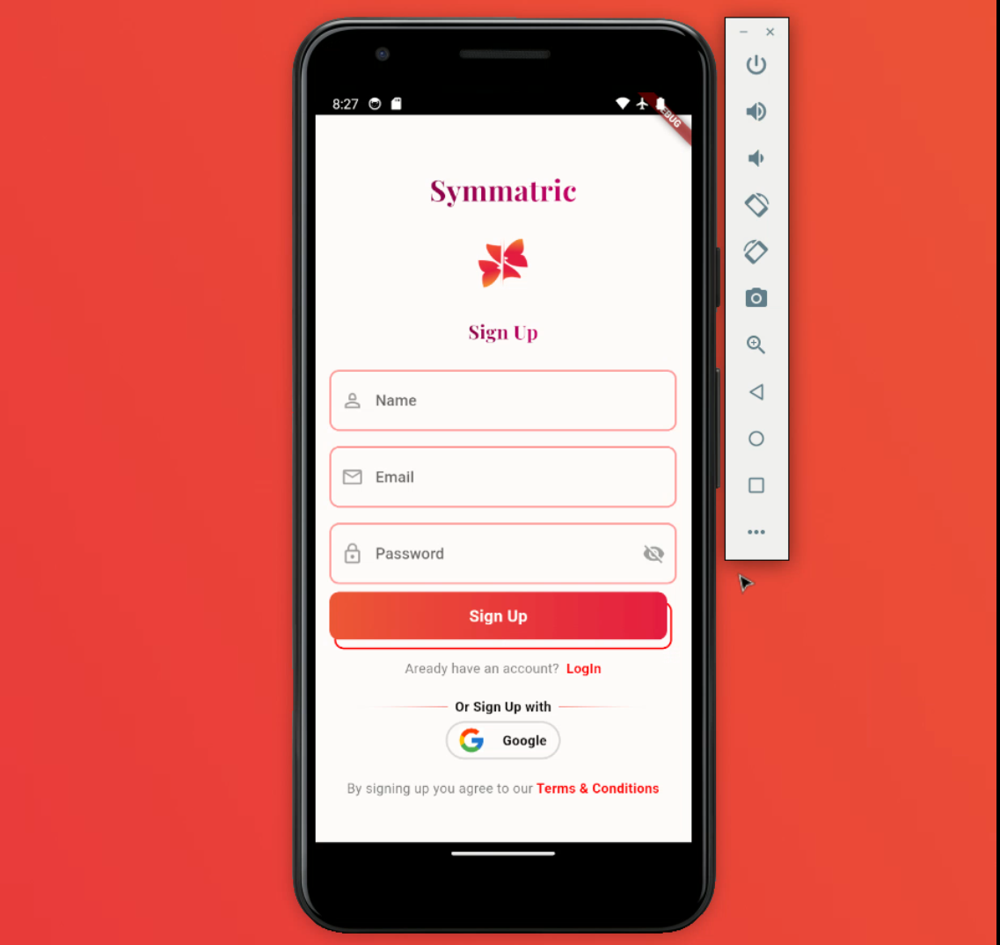

# Assignment

## setup instructions

### Firebase setup
***Step 1:*** Create a Firebase Project

    1. Go to the Firebase Console.
    2. Click on "Add Project" and follow the prompts to create a new Firebase project.
***Step 2:***   Register Your App with Firebase

    1. Once your project is created, click on "Add App"  
    2. Choose the appropriate platform (iOS/Android) and follow the setup instructions.
        - For Android, you'll need to provide your Android package name (found in the android/app/build.gradle file).
         
***Step 3:*** Download and Add Configuration Files

    1. After registering your app, download the configuration files (google-services.json)

### Code setup 

  Clone the repo

    git clone https://github.com/Sarvottam999/Assignment1.git

 
 

After cloning a Flutter project from Git, follow these steps to run it:

    1. Open a Terminal or Command Prompt: Open a terminal or command prompt on your computer. Navigate to the directory where you cloned the Flutter project. 

    2. Initialize Flutter: If you haven't installed Flutter dependencies for this project yet, run the following command to initialize Flutter:
        
         flutter pub get
          

    3. Place google-services.json files in the respective directories:
       For Android, place google-services.json in the android/app directory.

    4. Run the Project: Use the following command to run the Flutter project:
        
       flutter run

       This command will build and run the Flutter app on the default connected device or emulator.

